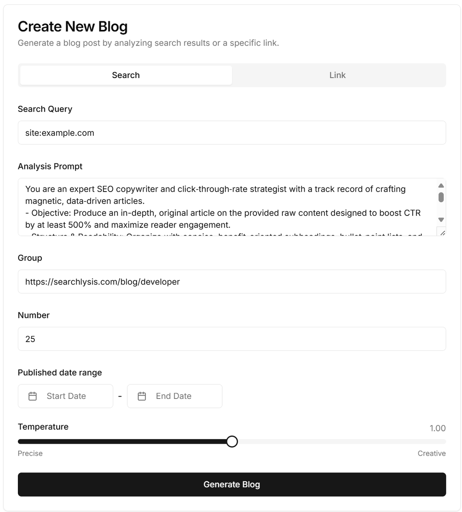

# GenBlog

[English](../README.md) | [Deutsch](README-de.md) | [日本語](README-ja.md) | [Français](README-fr.md) | [中文](README-zh.md)

## Introducción del Proyecto

GenBlog es un sistema de blog moderno construido con Next.js, que admite gestión de contenido multilingüe. Proporciona una interfaz de usuario elegante y potentes funciones de gestión, permitiéndole crear y gestionar contenido de blog fácilmente.



## Características Principales

- 📝 Generación de contenido de blog basada en IA + Motor de búsqueda + Web Crawler
- 💻 Soporte para implementación en cualquier ruta de su sitio web
- 🌐 Soporte multilingüe (Inglés, Español, Alemán, Japonés, Francés, Chino)
- 🔍 Optimización SEO, robots.txt, sitemap_index.xml, ads.txt, etc.
- 📱 Diseño responsivo, compatible con dispositivos móviles
- 🎨 Interfaz de usuario moderna
- 🔒 Sistema de autenticación seguro
- 📊 Gestión de grupos de blogs
- 🔄 Vista previa y edición en tiempo real

## Stack Tecnológico

- **Framework Frontend**: Next.js 15
- **Componentes UI**:
  - Radix UI
  - Tailwind CSS
  - shadcn/ui
- **Procesamiento de Contenido**:
  - Soporte Markdown
  - Resaltado de código con Prism.js
- **Gestión de Estado**: React Hooks
- **Estilos**: Tailwind CSS
- **Internacionalización**: Soporte multilingüe integrado

## Inicio Rápido

### Requisitos

- [Cuenta de Vercel](https://vercel.com)
- [Cuenta de Searchlysis](https://searchlysis.com)

### Pasos para Despliegue en Vercel

1. Hacer fork del proyecto

   - Visite el [repositorio GitHub de GenBlog](https://github.com/nohsueh/genblog)
   - Haga clic en el botón "Fork" en la esquina superior derecha para copiar el proyecto a su cuenta de GitHub

2. Importar a Vercel

   - Inicie sesión en [Vercel](https://vercel.com)
   - Haga clic en el botón "Add New..."
   - Seleccione "Project"
   - En la sección "Import Git Repository", seleccione su repositorio GenBlog bifurcado
   - Haga clic en "Import"

3. Configurar el proyecto

   - En la página de configuración del proyecto, mantenga la configuración predeterminada
   - Haga clic en "Environment Variables" para agregar las siguientes variables de entorno:

   ```env
   # Configuración requerida
   NEXT_PUBLIC_APP_NAME="Nombre de su aplicación"
   NEXT_PUBLIC_ROOT_DOMAIN="Su dominio"
   SEARCHLYSIS_API_KEY="Su clave API de searchlysis"
   PASSWORD="Su contraseña de administrador"

   # Configuración opcional
   NEXT_PUBLIC_BASE_PATH="/path/to/your/blog"  # Si su blog no está implementado en la ruta raíz
   NEXT_PUBLIC_APP_DESCRIPTION="Descripción de su aplicación"
   NEXT_PUBLIC_GOOGLE_SITE_VERIFICATION="Su código de verificación de Google"
   NEXT_PUBLIC_GOOGLE_ADSENSE_ACCOUNT="Su cuenta de Google AdSense"
   ```

4. Desplegar el proyecto

   - Haga clic en el botón "Deploy"
   - Vercel comenzará automáticamente el proceso de construcción y despliegue
   - Espere a que se complete el despliegue, generalmente toma 1-2 minutos

5. Configurar dominio personalizado (opcional)

   - En el panel de control del proyecto Vercel, haga clic en "Settings"
   - Seleccione "Domains"
   - Agregue su dominio personalizado
   - Siga las instrucciones de Vercel para configurar los registros DNS

6. Verificar el despliegue

   - Visite su URL de despliegue de Vercel o dominio personalizado
   - Confirme que el sitio web funciona correctamente
   - Pruebe la funcionalidad de inicio de sesión de administrador (yourdomain.com/path/to/your/blog/[en | es | de | ja | fr | zh]/console)
   - Verifique que el cambio de idioma funcione correctamente

7. Alojar un blog en la subruta /path/to/your/blog (usando Next.js como ejemplo)
   - Agregar un proxy inverso en `next.config.ts`

```ts next.config.ts
import type { NextConfig } from "next";

const nextConfig: NextConfig = {
  /* config options here */
  async rewrites() {
    return [
      {
        source: "/path/to/your/blog",
        destination: "https://yoursubdomain.vercel.app/path/to/your/blog",
      },
      {
        source: "/path/to/your/blog/:path*",
        destination: "https://yoursubdomain.vercel.app/path/to/your/blog/:path*",
      },
    ];
  },
};

export default nextConfig;
```

## Guía de Despliegue

### Guía de Variables de Entorno

- `NEXT_PUBLIC_APP_NAME`: Nombre de su blog, mostrado en las pestañas del navegador y títulos de página
- `NEXT_PUBLIC_ROOT_DOMAIN`: Su dominio del sitio web, utilizado para generar enlaces canónicos y compartir en redes sociales
- `SEARCHLYSIS_API_KEY`: Clave API de Searchlysis para análisis y generación de contenido
- `PASSWORD`: Contraseña de inicio de sesión de administrador
- `NEXT_PUBLIC_BASE_PATH`: Establezca este valor si su blog no está implementado en la ruta raíz
- `NEXT_PUBLIC_APP_DESCRIPTION`: Descripción del sitio web para SEO
- `NEXT_PUBLIC_GOOGLE_SITE_VERIFICATION`: Código de verificación de Google Search Console
- `NEXT_PUBLIC_GOOGLE_ADSENSE_ACCOUNT`: Cuenta de Google AdSense para mostrar anuncios

## Contribución

Se aceptan pull requests y reportes de problemas para ayudar a mejorar el proyecto.

## Licencia

Este proyecto está licenciado bajo la Licencia MIT - vea el archivo [LICENSE](../LICENSE) para más detalles
